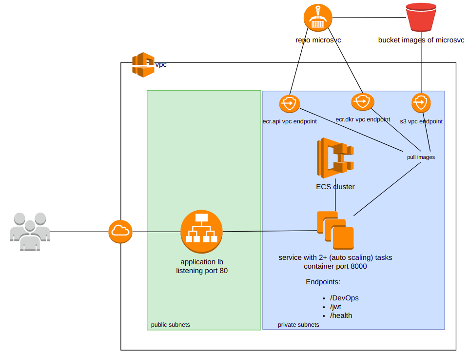

# microsvc app

## endpoints:
- get /docs: openapi spec
- get /jwt: get jwt token
- get /health: health check
- post /DevOps: send messages

## Pipelines
- CI - microsvc/.github/workflows/ci.yml: runs lint, test and build (on tag) container image.
- CD - microsvc/.github/workflows/ci.yml: manual execution with tag name as input to deploy container to ECS service

## Repository secrets
- API_KEY: key for protect endpoint DevOps
- SECRET_KEY : secret for jwt token
- AWS_ACCESS_KEY_ID: AWS_ACCESS_KEY_ID
- AWS_SECRET_ACCESS_KEY: AWS_SECRET_ACCESS_KEY
- ECR_REPOSITORY_URL: registry 

## Repository variables
- AWS_REGION: region of the environment

## infrastructure as code
Repo for building all the cloud infrastructure in AWS: https://github.com/andrescueva/microsvc-infra

